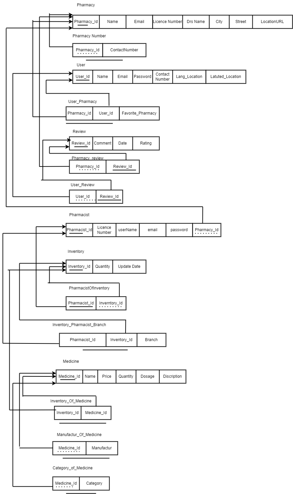
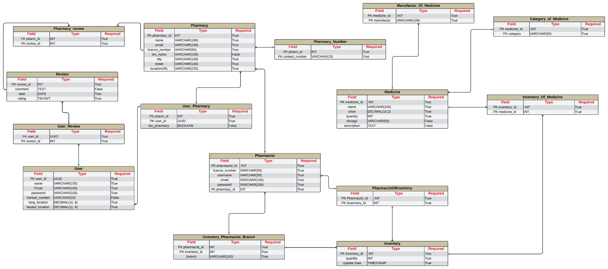
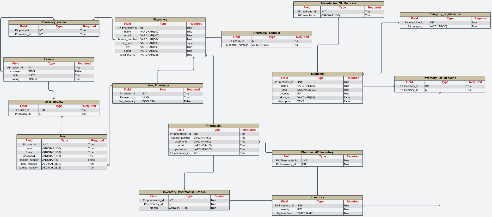

## Writing ERD For Example : Pharmacy

**Dawaya**

**This application will help users easily find nearby pharmacies that have the medicines they need.**

- **Each pharmacy** that is recorded at Dawaya has an ID (unique) , Profile photo may be a logo, Name, Email.

A pharmacy can employ multiple pharmacists, have multiple inventory items and multiple reviews.

- **Each Pharmacist** that is recorded at Dawaya has an Pharmacist ID (unique), Full name , Email , Password and License Number.

Each pharmacist works at only one pharmacy and manage branch’s e**nventory**.

- **Each user** that is recorded at Dawaya has an ID (unique) , Full name , Email , Password and a Phone Number address(city, Streat name, locationURL).

A user can leave one review to every pharmacy **and** can add more than one pharmacy to his favorite list

- **Enventory** keeps track of the quantity and details of medicines at different pharmacies.

Inventory ID (unique), update date and Quantity.

Each inventory record refers to many medicines and belongs to one pharmacy.

- **Each Branch** recorded at a pharmacy has an ID (unique), pharmacy name, address(city, ST, locationURL), licence number, may have a photos of the place , contact numbers, opening houres, Drs name and **Enventory** record

**Each Branch can have a multipule pharmacist but at least one the branch**

- **Each Medicine** that is recorded at Dawaya has a Medicine ID(unique) , Name , description, Dosage, Manufacturer ,category , Price and The Available Quantity .

A medicine can be listed in multiple inventory records at different pharmacies and belongs to one category.

- **Review** Requests user feedback on pharmacies.

Review ID (unique), Rating (1-5) , Comment and Review Date.

Each review is written by one user and for one

pharmacy.

## ERD Diagram

[ERD.drawio](DATABASE_IMAGES/ERD.drawio)

## Mapping

[Mapping.drawio](DATABASE_IMAGES/Mapping.drawio)

## Schema

live Schema: ‣

